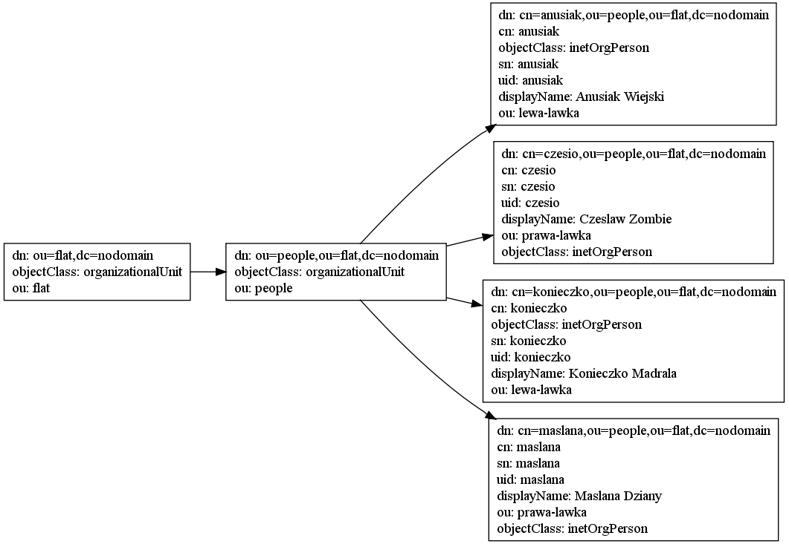
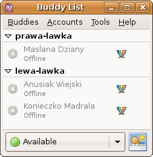
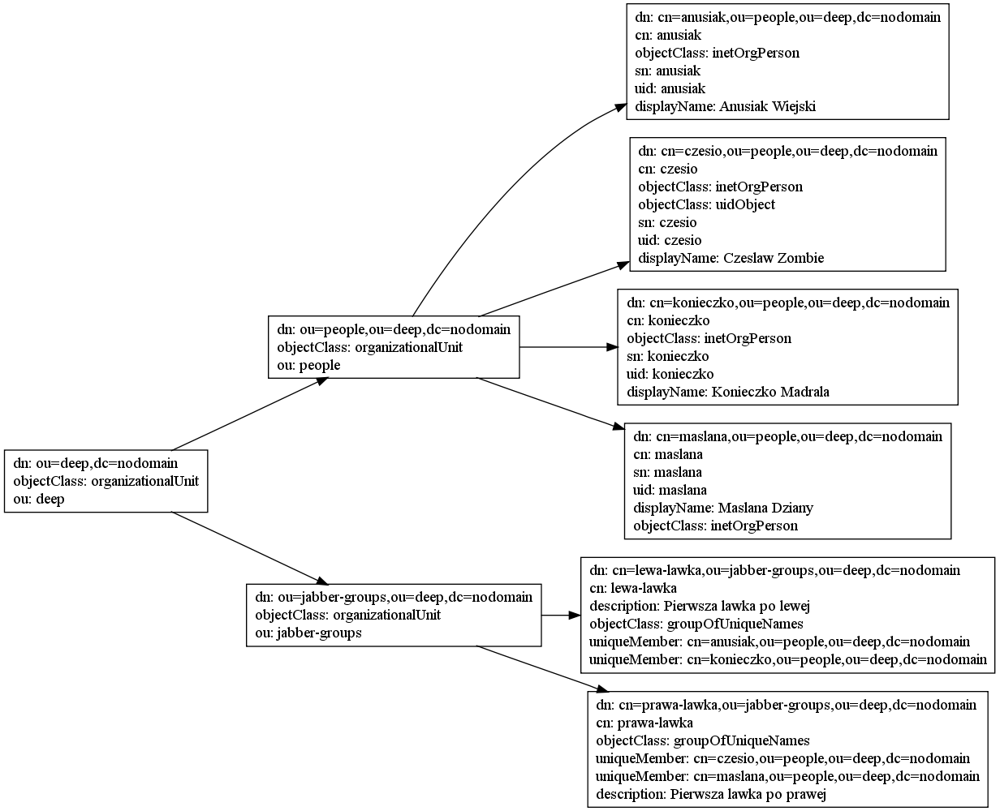
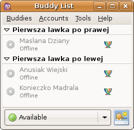

# LDAP Configuration

## Supported storages

The following LDAP servers are tested with `ejabberd`:

- `Active Directory` (see section [Active Directory](#active-directory))

- [`OpenLDAP`](https://openldap.org/)

- [`CommuniGate Pro`](https://communigate.com/)

- Normally any LDAP compatible server should work; inform us about
 your success with a not-listed server so that we can list it here.

## LDAP

`ejabberd` has built-in LDAP support. You can authenticate users against
LDAP server and use LDAP directory as vCard storage.

Usually `ejabberd` treats LDAP as a read-only storage: it is possible to
consult data, but not possible to create accounts or edit vCard that is
stored in LDAP. However, it is possible to change passwords if
`mod_register` module is enabled and LDAP server supports
[`RFC 3062`](https://tools.ietf.org/html/rfc3062).

## LDAP Connection

Two connections are established to the LDAP server per vhost, one for
authentication and other for regular calls.

To configure the LDAP connection there are these top-level options:

- [ldap_servers](toplevel.md#ldap_servers)
- [ldap_backups](toplevel.md#ldap_backups)
- [ldap_encrypt](toplevel.md#ldap_encrypt)
- [ldap_tls_verify](toplevel.md#ldap_tls_verify)
- [ldap_tls_certfile](toplevel.md#ldap_tls_certfile)
- [ldap_tls_cacertfile](toplevel.md#ldap_tls_cacertfile)
- [ldap_tls_depth](toplevel.md#ldap_tls_depth)
- [ldap_port](toplevel.md#ldap_port)
- [ldap_rootdn](toplevel.md#ldap_rootdn)
- [ldap_password](toplevel.md#ldap_password)
- [ldap_deref_aliases](toplevel.md#ldap_deref_aliases)

Example:

``` yaml
auth_method: [ldap]
ldap_servers:
  - ldap1.example.org
ldap_port: 389
ldap_rootdn: "cn=Manager,dc=domain,dc=org"
ldap_password: "**********"
```

When there are several LDAP servers available as backup,
set one in `ldap_servers` and the others in `ldap_backups`.
At server start, ejabberd connects to all the servers listed in `ldap_servers`.
If a connection is lost, ejabberd connects to the next server in `ldap_backups`.
If the connection is lost, the next server in the list is connected,
and this repeats infinitely with all the servers in `ldap_servers` and `ldap_backups`
until one is successfully connected:

``` yaml
ldap_servers:
  - ldap1.example.org

ldap_backups:
  - ldap2.example.org
  - ldap3.example.org
```

## LDAP Authentication

You can authenticate users against an LDAP directory. Note that current
LDAP implementation does not support SASL authentication.

To configure LDAP authentication there are these top-level options:

- [ldap_base](toplevel.md#ldap_base)
- [ldap_uids](toplevel.md#ldap_uids)
- [ldap_filter](toplevel.md#ldap_filter)
- [ldap_dn_filter](toplevel.md#ldap_dn_filter)

## LDAP Examples

### Common example

Let’s say `ldap.example.org` is the name of our LDAP server. We have
users with their passwords in `ou=Users,dc=example,dc=org` directory.
Also we have addressbook, which contains users emails and their
additional infos in `ou=AddressBook,dc=example,dc=org` directory. The
connection to the LDAP server is encrypted using TLS, and using the
custom port 6123. Corresponding authentication section should looks like
this:

``` yaml
## Authentication method
auth_method: [ldap]
## DNS name of our LDAP server
ldap_servers: [ldap.example.org]
## Bind to LDAP server as "cn=Manager,dc=example,dc=org" with password "secret"
ldap_rootdn: "cn=Manager,dc=example,dc=org"
ldap_password: secret
ldap_encrypt: tls
ldap_port: 6123
## Define the user's base
ldap_base: "ou=Users,dc=example,dc=org"
## We want to authorize users from 'shadowAccount' object class only
ldap_filter: "(objectClass=shadowAccount)"
```

Now we want to use users LDAP-info as their vCards. We have four
attributes defined in our LDAP schema: `mail` — email address,
`givenName` — first name, `sn` — second name, `birthDay` — birthday.
Also we want users to search each other. Let’s see how we can set it up:

``` yaml
modules:
  mod_vcard:
    db_type: ldap
    ## We use the same server and port, but want to bind anonymously because
    ## our LDAP server accepts anonymous requests to
    ## "ou=AddressBook,dc=example,dc=org" subtree.
    ldap_rootdn: ""
    ldap_password: ""
    ## define the addressbook's base
    ldap_base: "ou=AddressBook,dc=example,dc=org"
    ## uidattr: user's part of JID is located in the "mail" attribute
    ## uidattr_format: common format for our emails
    ldap_uids:
      mail: "%u@mail.example.org"
    ## We have to define empty filter here, because entries in addressbook does not
    ## belong to shadowAccount object class
    ldap_filter: ""
    ## Now we want to define vCard pattern
    ldap_vcard_map:
     NICKNAME: {"%u": []} # just use user's part of JID as their nickname
     GIVEN: {"%s": [givenName]}
     FAMILY: {"%s": [sn]}
     FN: {"%s, %s": [sn, givenName]} # example: "Smith, John"
     EMAIL: {"%s": [mail]}
     BDAY: {"%s": [birthDay]}
    ## Search form
    ldap_search_fields:
      User: "%u"
      Name: givenName
      "Family Name": sn
      Email: mail
      Birthday: birthDay
    ## vCard fields to be reported
    ## Note that JID is always returned with search results
    ldap_search_reported:
      "Full Name": FN
      Nickname: NICKNAME
      Birthday: BDAY
```

Note that `mod_vcard` with LDAP backend checks for the existence of the user
before searching their information in LDAP.

### Active Directory

Active Directory is just an LDAP-server with predefined attributes. A
sample configuration is shown below:

``` yaml
auth_method: [ldap]
ldap_servers: [office.org]  # List of LDAP servers
ldap_base: "DC=office,DC=org" # Search base of LDAP directory
ldap_rootdn: "CN=Administrator,CN=Users,DC=office,DC=org" # LDAP manager
ldap_password: "*******" # Password to LDAP manager
ldap_uids: [sAMAccountName]
ldap_filter: "(memberOf=*)"

modules:
  mod_vcard:
    db_type: ldap
    ldap_vcard_map:
      NICKNAME: {"%u": []}
      GIVEN: {"%s": [givenName]}
      MIDDLE: {"%s": [initials]}
      FAMILY: {"%s": [sn]}
      FN: {"%s": [displayName]}
      EMAIL: {"%s": [mail]}
      ORGNAME: {"%s": [company]}
      ORGUNIT: {"%s": [department]}
      CTRY: {"%s": [c]}
      LOCALITY: {"%s": [l]}
      STREET: {"%s": [streetAddress]}
      REGION: {"%s": [st]}
      PCODE: {"%s": [postalCode]}
      TITLE: {"%s": [title]}
      URL: {"%s": [wWWHomePage]}
      DESC: {"%s": [description]}
      TEL: {"%s": [telephoneNumber]}
    ldap_search_fields:
      User: "%u"
      Name: givenName
      "Family Name": sn
      Email: mail
      Company: company
      Department: department
      Role: title
      Description: description
      Phone: telephoneNumber
    ldap_search_reported:
      "Full Name": FN
      Nickname: NICKNAME
      Email: EMAIL
```

## Shared Roster in LDAP

Since [mod_shared_roster_ldap](modules.md#mod_shared_roster_ldap) has a few complex options,
some of them are documented with more detail here:

### Filters

**`ldap_ufilter`**:   “User Filter” – used for retrieving the human-readable name of
 roster entries (usually full names of people in the roster). See
 also the parameters `ldap_userdesc` and `ldap_useruid`. If
 unspecified, defaults to the top-level parameter of the same name.
 If that one also is unspecified, then the filter is assembled from
 values of other parameters as follows (`[ldap_SOMETHING]` is used to
 mean “the value of the configuration parameter
 `ldap_SOMETHING`”):

``` sh
(&(&([ldap_memberattr]=[ldap_memberattr_format])([ldap_groupattr]=%g))[ldap_filter])
```

Subsequently `%u` and `%g` are replaced with a \*.
This means that given the defaults, the filter sent to the LDAP
server would be `(&(memberUid=*)(cn=*))`. If however the
`ldap_memberattr_format` is something like
`uid=%u,ou=People,o=org`, then the filter will be
`(&(memberUid=uid=*,ou=People,o=org)(cn=*))`.

**`ldap_filter`**:   Additional filter which is AND-ed together with *User
 Filter* and *Group Filter*. If unspecified,
 defaults to the top-level parameter of the same name. If that one is
 also unspecified, then no additional filter is merged with the other
 filters.

Note that you will probably need to manually define the
*User* and *Group Filter* (since the
auto-assembled ones will not work) if:

- your `ldap_memberattr_format` is anything other than a
 simple `%u`,

- **and** the attribute specified with `ldap_memberattr` does not support substring matches.

An example where it is the case is OpenLDAP and
*(unique)MemberName* attribute from the
*groupOf(Unique)Names* objectClass. A symptom of this problem
is that you will see messages such as the following in your
`slapd.log`:

``` sh
get_filter: unknown filter type=130
filter="(&(?=undefined)(?=undefined)(something=else))"
```

### Control parameters

These parameters control the behaviour of the module.

**`ldap_memberattr_format_re`**:   A regex for extracting user ID from the value of the attribute named
 by `ldap_memberattr`.

An example value `“CN=(\\w*),(OU=.*,)*DC=company,DC=com”` works for user IDs such as the following:

- `CN=Romeo,OU=Montague,DC=company,DC=com`
- `CN=Abram,OU=Servants,OU=Montague,DC=company,DC=com`
- `CN=Juliet,OU=Capulet,DC=company,DC=com`
- `CN=Peter,OU=Servants,OU=Capulet,DC=company,DC=com`

In case:

- the option is unset,
- or the `re` module in unavailable in the current Erlang environment,
- or the regular expression does not compile,

then instead of a regular expression, a simple format specified by
`ldap_memberattr_format` is used. Also, in the last two
cases an error message is logged during the module initialization.

Also, note that in all cases `ldap_memberattr_format`
(and `*not*` the regex version) is used for constructing
the default “User/Group Filter” — see section [Filters](#filters).

### Retrieving the roster

When the module is called to retrieve the shared roster for a user, the following algorithm is used:

1. [step:rfilter] A list of names of groups to display is created: the *Roster Filter* is run against the base DN, retrieving the values of the attribute named by `ldap_groupattr`.

2. Unless the group cache is fresh (see the `ldap_group_cache_validity` option), it is refreshed:

    1. Information for all groups is retrieved using a single query: the *Group Filter* is run against the Base DN, retrieving the values of attributes named by `ldap_groupattr` (group ID), `ldap_groupdesc` (group “Display Name”) and `ldap_memberattr` (IDs of group members).

    2. group “Display Name”, read from the attribute named by `ldap_groupdesc`, is stored in the cache for the
  given group

    3. the following processing takes place for each retrieved value of attribute named by `ldap_memberattr`:

        1. the user ID part of it is extracted using `ldap_memberattr_format(_re)`,

        2. then (unless `ldap_auth_check` is set to `off`) for each found user ID, the module checks (using the `ejabberd` authentication subsystem) whether such user exists in the given virtual host. It is skipped if the check is enabled and fails.
   This step is here for historical reasons. If you have a tidy DIT and properly defined “Roster Filter” and “Group Filter”, it is safe to disable it by setting `ldap_auth_check` to `off` — it will speed up the roster retrieval.

        3. the user ID is stored in the list of members in the cache for the given group.

3. For each item (group name) in the list of groups retrieved in step [step:rfilter]:

    1. the display name of a shared roster group is retrieved from the group cache

    2. for each IDs of users which belong to the group, retrieved from the group cache:

        1. the ID is skipped if it’s the same as the one for which we are retrieving the roster. This is so that the user does not have himself in the roster.

        2. the display name of a shared roster user is retrieved:

            1. first, unless the user name cache is fresh (see the `ldap_user_cache_validity` option), it is refreshed by running the *User Filter*, against the Base DN, retrieving the values of attributes named by `ldap_useruid` and `ldap_userdesc`.

            2. then, the display name for the given user ID is retrieved from the user name cache.

### Multi-Domain

By default, the module option `ldap_userjidattr` is set to the empty string,
in that case the JID of the user's contact is formed by compounding
UID of the contact `@` Host of the user owning the roster.

When the option `ldap_userjidattr` is set to something like `"mail"`,
then it uses that field to determine the JID of the contact. This is
useful if the ldap `mail` attribute contains the JID of the accounts.

Basically, it allows us to define a groupOfNames
(e.g. xmppRosterGroup) and list any users, anywhere in the ldap
directory by specifying the attribute defining the JID of the
members.

This allows hosts/domains other than that of the roster owner. It is
also more flexible, since the LDAP manager can specify the JID of the
users without any assumptions being made. The only down side is that
there must be an LDAP attribute (field) filled in for all Jabber/XMPP
users.

Below is a sample, a relevant LDAP entry, and ejabberd's module configuration:

``` yaml
cn=Example Org Roster,ou=groups,o=Example Organisation,dc=acme,dc=com
objectClass: groupOfNames
objectClass: xmppRosterGroup
objectClass: top
xmppRosterStatus: active
member:
description: Roster group for Example Org
cn: Example Org Roster
uniqueMember: uid=john,ou=people,o=Example Organisation,dc=acme,dc=com
uniqueMember: uid=pierre,ou=people,o=Example Organisation,dc=acme,dc=com
uniqueMember: uid=jane,ou=people,o=Example Organisation,dc=acme,dc=com

uid=john,ou=people,o=Example Organisation,dc=acme,dc=com
objectClass: top
objectClass: person
objectClass: organizationalPerson
objectClass: inetOrgPerson
objectClass: mailUser
objectClass: sipRoutingObject
uid: john
givenName: John
sn: Doe
cn: John Doe
displayName: John Doe
accountStatus: active
userPassword: secretpass
IMAPURL: imap://imap.example.net:143
mailHost: smtp.example.net
mail: john@example.net
sipLocalAddress: john@example.net
```

Below is the sample ejabberd.yml module configuration to match:

``` yaml
mod_shared_roster_ldap:
  ldap_servers:
    - "ldap.acme.com"
  ldap_encrypt: tls
  ldap_port: 636
  ldap_rootdn: "cn=Manager,dc=acme,dc=com"
  ldap_password: "supersecretpass"
  ldap_base: "dc=acme,dc=com"
  ldap_filter: "(objectClass=*)"
  ldap_rfilter: "(&(objectClass=xmppRosterGroup)(xmppRosterStatus=active))"
  ldap_gfilter: "(&(objectClass=xmppRosterGroup)(xmppRosterStatus=active)(cn=%g))"
  ldap_groupattr: "cn"
  ldap_groupdesc: "cn"
  ldap_memberattr: "uniqueMember"
  ldap_memberattr_format_re: "uid=([a-z.]*),(ou=.*,)*(o=.*,)*dc=acme,dc=com"
  ldap_useruid: "uid"
  ldap_userdesc: "cn"
   ldap_userjidattr: "mail"
   ldap_auth_check: false
   ldap_user_cache_validity: 86400
   ldap_group_cache_validity: 86400
```

### Configuration examples

Since there are many possible
[`DIT`](https://en.wikipedia.org/wiki/Directory_Information_Tree)
layouts, it will probably be easiest to understand how to configure the
module by looking at an example for a given DIT (or one resembling it).

#### Flat DIT

This seems to be the kind of DIT for which this module was initially
designed. Basically there are just user objects, and group membership is
stored in an attribute individually for each user. For example in a
layout like this, it's stored in the `ou` attribute:



Such layout has a few downsides, including:

- information duplication – the group name is repeated in every member
 object

- difficult group management – information about group members is not
 centralized, but distributed between member objects

- inefficiency – the list of unique group names has to be computed by
 iterating over all users

This however seems to be a common DIT layout, so the module keeps
supporting it. You can use the following configuration…

``` yaml
modules:
  mod_shared_roster_ldap:
    ldap_base: "ou=flat,dc=nodomain"
    ldap_rfilter: "(objectClass=inetOrgPerson)"
    ldap_groupattr: ou
    ldap_memberattr: cn
    ldap_filter: "(objectClass=inetOrgPerson)"
    ldap_userdesc: displayName
```

…to be provided with a roster upon connecting as user `czesio`,
as shown in this figure:



#### Deep DIT

This type of DIT contains distinctly typed objects for users and groups
– see the next figure. They are shown separated into
different subtrees, but it’s not a requirement.



If you use the following example module configuration with it:

``` yaml
modules:
  mod_shared_roster_ldap:
    ldap_base: "ou=deep,dc=nodomain"
    ldap_rfilter: "(objectClass=groupOfUniqueNames)"
    ldap_filter: ""
    ldap_gfilter: "(&(objectClass=groupOfUniqueNames)(cn=%g))"
    ldap_groupdesc: description
    ldap_memberattr: uniqueMember
    ldap_memberattr_format: "cn=%u,ou=people,ou=deep,dc=nodomain"
    ldap_ufilter: "(&(objectClass=inetOrgPerson)(cn=%u))"
    ldap_userdesc: displayName
```

…and connect as user `czesio`, then `ejabberd` will provide
you with the roster shown in this figure:



## vCard in LDAP

Since LDAP may be complex to configure in [mod_vcard](modules.md#mod_vcard),
this section provides more details.

`ejabberd` can map LDAP attributes to vCard fields. This feature is
enabled when the `mod_vcard` module is configured with `db_type:
ldap`. Notice that it does not depend on the authentication method
(see [LDAP Authentication](#ldap-authentication)).

Usually `ejabberd` treats LDAP as a read-only storage: it is possible to
consult data, but not possible to create accounts or edit vCard that is
stored in LDAP. However, it is possible to change passwords if
`mod_register` module is enabled and LDAP server supports
[`RFC 3062`](https://tools.ietf.org/html/rfc3062).

This feature has its own optional parameters. The first
group of parameters has the same meaning as the top-level LDAP
parameters to set the authentication method: `ldap_servers`,
`ldap_port`, `ldap_rootdn`, `ldap_password`, `ldap_base`, `ldap_uids`,
`ldap_deref_aliases` and `ldap_filter`. See section
[LDAP Authentication](#ldap-authentication) for
detailed information about these options. If one of these options is not
set, `ejabberd` will look for the top-level option with the same name.

Examples:

- Let’s say `ldap.example.org` is the name of our LDAP server. We have
 users with their passwords in `ou=Users,dc=example,dc=org`
 directory. Also we have addressbook, which contains users emails and
 their additional infos in `ou=AddressBook,dc=example,dc=org`
 directory. Corresponding authentication section should looks like
 this:

    ``` yaml
    ## authentication method
    auth_method: ldap
    ## DNS name of our LDAP server
    ldap_servers:
      - ldap.example.org
    ## We want to authorize users from 'shadowAccount' object class only
    ldap_filter: "(objectClass=shadowAccount)"
    ```

- Now we want to use users LDAP-info as their vCards. We have four
attributes defined in our LDAP schema: `mail` — email address,
`givenName` — first name, `sn` — second name, `birthDay` — birthday.
Also we want users to search each other. Let’s see how we can set it
up:

    ``` yaml
    modules:
      mod_vcard:
        db_type: ldap
        ## We use the same server and port, but want to bind anonymously because
        ## our LDAP server accepts anonymous requests to
        ## "ou=AddressBook,dc=example,dc=org" subtree.
        ldap_rootdn: ""
        ldap_password: ""
        ## define the addressbook's base
        ldap_base: "ou=AddressBook,dc=example,dc=org"
        ## uidattr: user's part of JID is located in the "mail" attribute
        ## uidattr_format: common format for our emails
        ldap_uids: {"mail": "%u@mail.example.org"}
        ## Now we want to define vCard pattern
        ldap_vcard_map:
          NICKNAME: {"%u": []} # just use user's part of JID as their nickname
          FIRST: {"%s": [givenName]}
          LAST: {"%s": [sn]}
          FN: {"%s, %s": [sn, givenName]} # example: "Smith, John"
          EMAIL: {"%s": [mail]}
          BDAY: {"%s": [birthDay]}
        ## Search form
        ldap_search_fields:
          User: "%u"
          Name: givenName
          "Family Name": sn
          Email: mail
          Birthday: birthDay
        ## vCard fields to be reported
        ## Note that JID is always returned with search results
        ldap_search_reported:
          "Full Name": FN
          Nickname: NICKNAME
          Birthday: BDAY
    ```

    Note that `mod_vcard` with LDAP backend checks an existence of the user
    before searching their info in LDAP.

- `ldap_vcard_map` example:

    ``` yaml
    ldap_vcard_map:
      NICKNAME: {"%u": []} # just use user's part of JID as their nickname
      FN: {"%s": [displayName]}
      CTRY: {Russia: []}
      EMAIL: {"%u@%d": []}
      DESC: {"%s\n%s": [title, description]}
    ```

- `ldap_search_fields` example:

    ``` yaml
    ldap_search_fields:
      User: uid
      "Full Name": displayName
      Email: mail
    ```

- `ldap_search_reported` example:

    ``` yaml
    ldap_search_reported:
      "Full Name": FN
      Email: EMAIL
      Birthday: BDAY
      Nickname: NICKNAME
    ```
