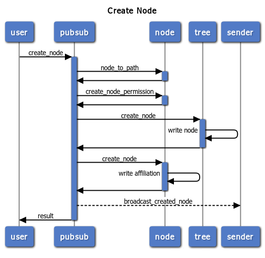
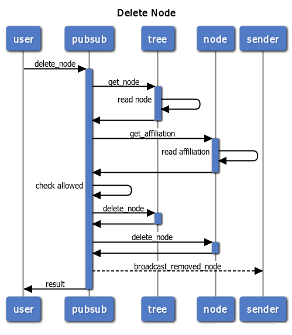
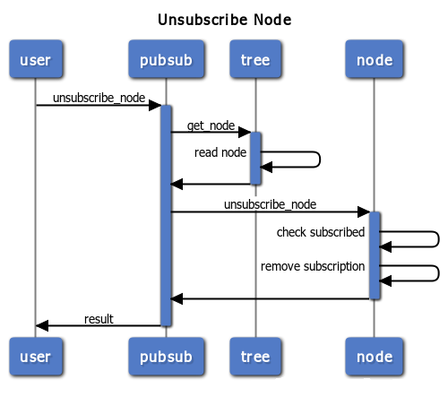
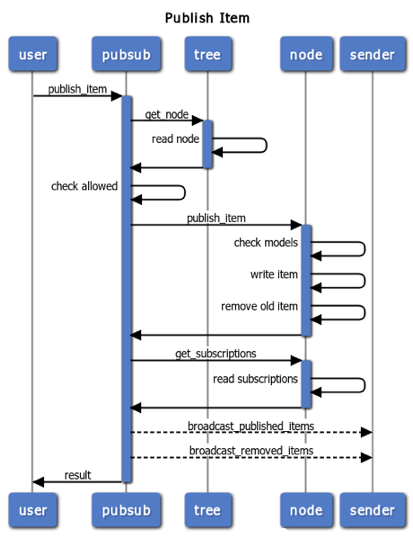

# PubSub overview

This document describes ejabberd's PubSub architecture to understand how to write custom plugins.

[`XEP-0060`](https://xmpp.org/extensions/xep-0060.html) (PubSub) is more than 100 pages of specifications, with 12 very detailed use cases with many possibles options and possible situations:

- Subscribe
- Unsubscribe
- Configure subscription
- Retrieve items
- Publish item
- Delete item
- Create node
- Configure node
- Delete node
- Purge node
- Manage subscriptions
- Manage affiliations

[`XEP-0163`](https://xmpp.org/extensions/xep-0163.html) (PEP) is based on PubSub XEP-0248 (deprecated) for Collection Nodes and uses generic PubSub functionality, specified in XEP-0060.

## History

Initial implementation made by Aleksey Shchepin, ability to organise nodes in a tree added by Christophe Romain in 2007.
First attempt to create a flexible API for plugins started in 2007, and improved until 2015.

## Implementation

PubSub service comes in several parts:

- A poll of iq handlers handled by ejabberd router
- A sending process
- A core router to perform high level actions for every use case
- Plugins to handle nodes, affiliations/subscriptions, and items at lower level and interface with data backend

### Nodetree plugins

They handles storage and organisation of PubSub nodes. Called on get, create and delete node.
Default implementation includes three plugins:

- tree: (default) both internal and odbc backend.
- virtual: no backend, no configurable nodes.
- dag: handles [`XEP-0248`](https://xmpp.org/extensions/xep-0248.html).

If all nodes shares same configuration, I/O on pubsub_node can be avoided using virtual nodetree.

### Node plugins

They handle affiliations, subscriptions and items. They provide default node configuration and features. Called on every pubsub use cases.
Each plugin is responsible of checks to handle all possibles cases and reply action result to PubSub engine to let it handle the routing.
The most common plugins available in default installation are:

- flat: (default) all nodes are in a flat namespace, there are no parent/child nodes
- hometree: all nodes are organized as in a filesystem under /home/hostname/user/...
- pep: handles [`XEP-0163`](https://xmpp.org/extensions/xep-0163.html)
- dag: handles [`XEP-0248`](https://xmpp.org/extensions/xep-0248.html).
- public, private, ... which are derivate of flat, with different default node configuration.

#### `node_flat`

`node_flat` is the default plugin, without node hierarchy, which handles standard PubSub case.
The default node configuration with this plugin is:

``` erlang
[{deliver_payloads, true},
 {notify_config, false},
 {notify_delete, false},
 {notify_retract, true},
 {purge_offline, false},
 {persist_items, true},
 {max_items, 10},
 {subscribe, true},
 {access_model, open},
 {roster_groups_allowed, []},
 {publish_model, publishers},
 {notification_type, headline},
 {max_payload_size, 60000},
 {send_last_published_item, on_sub_and_presence},
 {deliver_notifications, true},
 {presence_based_delivery, false}].
```

#### node_hometree

node_hometree use exact same features as flat plugin, but organise nodes in a tree following same scheme as path in filesystem.
Every user can create nodes in its own home. Each node can contain items and/or sub-nodes. Example:

``` sh
/home/user
/home/domain/user
/home/domain/user/my_node
/home/domain/user/my_node/child_node
```

#### node_pep

node_pep handles XEP-0163: Personal Eventing Protocol
It do not persist items, just keeping last item in memory cache. Node names are raw namespace attached to a given bare JID. Every user can have its own node with a common namespace sharing with others.

#### node_dag

node_dag handles XEP-0248: PubSub Collection Nodes Contribution from Brian Cully.
Every node takes places in a tree and is either a collection node (have only sub-nodes) or a leaf node (contains only items).
No restriction on the tree structure

## Plugin design

Due to complexity of XEP-0060, PubSub engine do successive calls to nodetree and node plugins in order to check validity, perform corresponding action and return result or appropriate error to users.
Plugin design follows this requirement and divide actions by type of data to allow transient backend implementation without any PubSub engine change.

### Create Node



### Delete Node



### Subscribe


### Unsubscribe



### Publish item



### Delete item


### Purge Node


### Get item


## Available backends

Flat, hometree and PEP supports mnesia and SQL backends.
Any derivated plugin can support the same (public, private, club, buddy...).
Adding backend does not require any PubSub engine change. Plugin just need to comply API.
Business Edition also supports optimized ets and mdb.

## Customisation

To write your own plugin, you need to implement needed functions:

``` erlang
[init/3, terminate/2, options/0, features/0,
 create_node_permission/6, create_node/2, delete_node/1,
 purge_node/2, subscribe_node/8, unsubscribe_node/4,
 publish_item/6, delete_item/4, remove_extra_items/3,
 get_entity_affiliations/2, get_node_affiliations/1,
 get_affiliation/2, set_affiliation/3,
 get_entity_subscriptions/2, get_node_subscriptions/1,
 get_subscriptions/2, set_subscriptions/4,
 get_pending_nodes/2, get_states/1, get_state/2,
 set_state/1, get_items/7, get_items/3, get_item/7,
 get_item/2, set_item/1, get_item_name/3, node_to_path/1,
 path_to_node/1]
```

Generic function must call their corresponding partner in `node_flat`.

Simple plugin would just call `node_flat` and override some defaults such as:

- options/0 and features/0 to match your needs. This triggers the way PubSub controls calls to your plugins.
- create_node_permission/6 for example to check an LDAP directory against an access flag
- Write your own tests on publish or create node, forbids explicit access to items, etc...

## Clustering

ejabberd's implementation tends to cover most generic and standard uses. It's good for common use, but far from optimal for edges or specific cases.
Nodes, affiliations, subscriptions and items are stored in a replicated database.
Each ejabberd node have access to all the data.
Each ejabberd node handles part of the load, but keep locking database cluster wide on node records write (pubsub_node)
Affiliations, subscriptions and items uses non blocking write (pubsub_state and pubsub_item)
