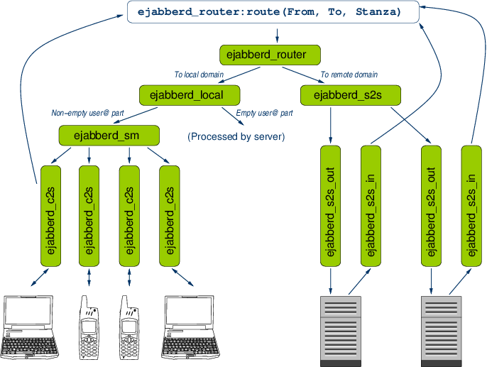

# ejabberd Stanza Routing

## Message Routing

In case of a message sent from User A to User B, both of whom are
served by the same domain, the flow of the message through the system
is as follows:

1. User A's `ejabberd_receiver` receives the stanza and passes it to
   `ejabberd_c2s`.
1. After some consistency check, `user_send_packet` is called if the
   stanza is correct.
1. The stanza is matched against any privacy lists in use and, in case
   of being allowed, routed by `ejabberd_router:route/3`.
1. `ejabberd_router:route/3` runs the `filter_packet`
   hook. `filter_packet` hook can drop of modify the stanza.
1. `ejabberd_router` will then consult the routing table to know what
   do to next. It is easier to understand by looking at an example of
   actual routing table content:

    ``` erlang
    (ejabberd@localhost)2> ets:tab2list(route).
    [{route,<<"pubsub.localhost">>,
      {apply_fun,#Fun<ejabberd_router.2.122122122>}},
    {route,<<"muc.localhost">>,
      {apply_fun,#Fun<mod_muc.2.122122123>}},
    {route,<<"localhost">>,{apply,ejabberd_local,route}}]
    ```

   In that case, user is local so we need to route to same domain (in
   our case localhost). We then can see that we have to call
   `ejabberd_local:route` to route the message to local user. As both
   user are local (no server-to-server involved), it matches our
   expectations.

1. `ejabberd_local` routes the stanza to `ejabberd_sm` given it's got at
   least a bare JID as the recipient.

1. `ejabberd_sm` determines the available resources of User B, takes
   into account their session priorities and whether the message is
   addressed to a particular resource or a bare JID and appropriately
   replicates (or not) the message and sends it to the recipient's
   `ejabberd_c2s` process(es).

   In case no resources are available for delivery (hence no
   `ejabberd_c2s` processes to pass the message to),
   `offline_message_hook` is run to delegate offline message storage.

1. `ejabberd_c2s` verifies the stanza against any relevant privacy
   lists and sends it on the user socket if it does exist. In the case
   of ejabberd Business Edition and ejabberd Saas, session can be
   detached and push notifications can be used as a fallback.
   `user_receive_packet` hook is run to notify the rest of the system
   about stanza delivery to User B.

Here is a broader diagram, including server-to-server routing:


